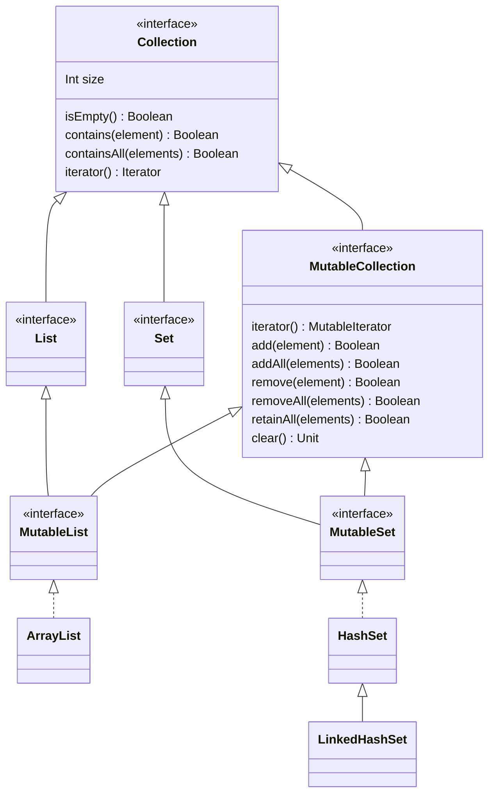

# 陣列 (Array)
kotlin 中陣列分為兩種，一種是
- **類型元素陣列** : 陣列內的元素都是參考類型的物件
- **基礎類型元素陣列** : 陣列內元素皆為基礎型別物件

## 1. 類型元素陣列
- 元素可空 : `arrayOfNulls<類型>(長度)`
   `arrayOfNulls<Int>(3)` -> `[0,0,0]`
- 宣告並初始化陣列 : `arrayOf<類型>(元素)`
  `arrayOf<Int>(1,2,3)` -> `[1,2,3]`
- 陣列建構式 : `Array<類型>(長度) { it(元素索引) }`
  `Array<Int>(3) { it + 1 }` -> `[1,2,3]`
- 複合類型元素 : `arrayOf(元素)`
  `arrayOf(1, "hello", true)` : 陣列元素類型會以 `Any` 來置入

## 2. 基本類型元素陣列
基本類型陣列宣告有各自對應的創建方法 :
- IntArray
- LongArray
- FloatArray
- DoubleArray
- BooleanArray
- ShortArray
- ByteArray
- CharArray

### 創建方式

- 指初始化長度 : `陣列方法(長度)`
  `IntArray(3)` -> `[0,0,0]`
- 陣列建構式 : `陣列方法(長度){ it(元素索引) }`
  `IntArray(3) { it }` -> `[0,1,2]`
- 宣告並初始化陣列 : kotlin 內建基本類型陣列方便創建的方法
  - `intArrayOf(元素)` -> `intArrayOf(1,2,3)` -> `[1,2,3]`
  - `charArrayOf(元素)` -> `charArrayOf('h','e','l','l','o')` -> `['h','e','l','l','o']`
  - 其他類型以此類推 : `longArrayOf`、`shortArrayOf`、`byteArrayOf`、`doubleArrayOf`、`floatArrayOf`、`booleanArrayOf`

## 內建屬性

- 可用於 `for-in` 宣告來輪巡元素
- 內建 `indices` 屬性可以拿到輪巡索引值
- 內建 `withIndex()` 方法可以輪巡元素(value)+索引值(index)的數組(tuple)

  範例
  ```kotlin
  val array = intArrayOf(1,2,3)
  for (tuple in array.withIndex()) {
    println("array[${tuple.index}] = ${tuple.value}")
  }
  ```

---

# 列表 (List)

**列表和陣列最大的差別是列表長度是可變動的，而陣列不行。**

kotlin 中的列表分為唯讀和可變兩種，唯讀列表在創建後就只能被讀取，不能做任何調整。

如果在創建的時候給定了元素內容，則不需要宣告元素類型，kotlin 會自動配適。

## 1. 唯讀列表

- 初始化元素 : `listOf<類型>(元素)`
  `listOf("Java", "Groovy", "Kotlin")` -> `["Java","Groovy","Kotlin"]`
- 自動排除空元素 : `listOfNotNull<類型>(元素)`
  `listOfNotNull("Java", null, "Kotlin")` -> `["Java", "Kotlin"]`
- 列表建構式 : `List<類型>(長度) { it(元素索引) }`
  `List(3) { 'a' + it }` -> `['a','b','c']`

## 2. 可變列表

- 初始化元素 : `mutableListOf<類型>(元素)`
- 列表建構式 : `MutableList<類型>(長度) { it(元素索引) }`

### 底層基於 java ArrayList 的列表

kotlin 中的 MutableList 底層的實現可以依照 kotlin 版本不同而不同，最早的版本 MutableList 的底層是用 java 的 LinkedList 實現，後來才改成 ArrayList，如果不希望因為 kotlin 版本問題而需要明確創建 java 的 ArrayList 結構，kotlin 也有提供明確的宣告方法

宣告方法 : `arrayListOf<類型>(元素)`

## 空列表

空列表是**不包含任何元素的唯讀列表**，通常用於預設回傳值，回傳時不需要再指定類型

宣告式 : `emptyList<類型>()`

```kotlin
fun getList():List<Int> {
  if (somecondition) {
    return listOf(1,2,3)
  }
  return emptyList() // <- 無須再指定類型
}
```

## 內建屬性

- `size` : 取得列表長度
- `get(索引)` : 取得索引元素，也可以使用索引存取子 `[索引]` 的方式
- `add(元素)` : 添加元素
- `set(索引, 元素)` : 覆蓋列表中索引所在元素，也可以使用索引存取子 `[索引] = 元素` 的方式
- `remove(元素)` : 刪除列表中指定元素，如果元素不存在則對列表沒有任何影響
- `removeAt(索引)` : 刪除列表中指定索引的元素，如果索引超過列表範圍則會拋出 IndexOutOfBoundsException
- 可用於 `for-in` 宣告來輪巡元素
- 內建 `indices` 屬性可以拿到輪巡索引值
- 內建 `withIndex()` 方法可以輪巡元素(value)+索引值(index)的數組(tuple)

---

# 集合 (Set)

- 元素不可重複
- 分為唯讀和可變集合
- 唯讀集合宣告 : `setOf<類型>(元素)`，同列表以此類推
- 可變集合宣告 : `mutableSetOf<類型>(元素)`，同列表以此類推
- 底層基於 java HashSet 的集合 : `hashSetOf<類型>(元素)`，kotlin 底層預設以 LinkedHashSet 實現
- 底層基於 java LinkedHashSet 的集合 : `linkedHashSet<類型>(元素)`，道理同上，依照 kotlin 版本不同，預設的 `setOf` 或者 `mutableSetOf` 底層實現可能不同，如果需要特別指定，可以這樣使用
- 底層基於 java treeSet 的集合 : `sortedSetOf<類型>(元素)`

## 空集合

道理同空列表

宣告式 : `emptySet<類型>()`

## 內建屬性

- `size` : 取得集合大小
- `add(元素)` : 添加元素
- `remove(元素)` : 刪除元素
- 可用於 `for-in` 宣告來輪巡元素

---

# 區間 (Range)

- 區間中的元素是連續的
- 區間只有儲存起始值和結束值
- 只有 : IntRange、LongRange、CharRange 三種區間類型
- 自動配適創建 : `開始值.rangeTo(結束值)`
  `'a'.rangeTo('c')`  -> `['a', 'c']`
  - 不包含結束值 : `開始值.until(結束值)`
    `'a'.until('c')` -> `['a','c')`
  - 反向宣告 : `開始值.downTo(結束值)`
    `3.downTo(1)` -> `[3,2,1]`
- 區間操作符號 : `開始值..結束值`
  `'a'..'c'` -> `['a', 'c']`

## 內建屬性

- `step(間隔)` : 區間元素間間隔預設為 1，這個方法可以改變元素間間隔
- `reversed()` : 開始值和結束值反向
- `contains(元素)` : 判斷該元素是否包含於區間中

---

# 序列 (Sequence)

序列是一組元素間有某種關係的數值數據

- 基礎宣告 : `sequenceOf(元素)`
  `sequence(1,2,3,5)` -> `1,2,3,5`
- 建構式 : `generateSequcene(種子){ it(種子或上一個元素) }`
  範例 : `[3,8,13,18]`
  ```kotlin
  val seq = generateSequence(3) {
    val t = it + 5 //第一個 it 會是種子，之後就會是上一個回傳值
    if (t > 20) { // 當超過 20 回傳 null，sequence 就會終止
      null
    } else {
      t
    }
  }
  ```

---


# 映射 (Map)

同上，kotlin 中的 mapping 也分為唯讀與可變兩種類型，預設情況，建立出來的會是 java.util.LinkedHashMap 的物件 (原理同 Set)

## 1. 唯讀映射

- 初始映射 : `mapOf<key類型, value類型>(元素)`
	- 使用 Pair 類型初始 : `Pair(key, value)`
		```kotlin
		val map = mapOf(Pair("name", "Tom"), Pair("national", "USA"))
		```
	- 使用 `to()` 方法初始 : `key to value`
		```kotlin
		val map = mapOf("name" to "Tom", "national" to "USA")
		```
		
## 2. 可變映射

- 初始映射 : `mutableMapOf<key類型, value類型>(元素)`
	- 初始方法和唯讀相同

### 底層基於 java.util.HashMap 映射

宣告方法 : `hashMapOf<key類型, value類型>(元素)`

### 底層基於 java.util.LinkedHashMap 映射

宣告方法 : `linkedHashMapOf<key類型, value類型>(元素)`

### 底層基於 java.util.TreeMap 映射

宣告方法 : `sortedMapOf<key類型, value類型>(元素)`

## 空映射

宣告方法 : `emptyMap<key類型, value類型>()`

和所有空集合的空實例相同，主要用於回傳時不需要再指定類型

## 內建屬性

- `size` : 取得映射元素個數
- `get(key)` : 取得 key 對應的 value 值，也可以使用索引存取子 `[key]` 來取得
	- 如果 key 不存在，則會返回空值
	- `getValue(key)` :  key 不存在會拋出例外而不是返回空值
	- `getOrDefault(key, default value)` : key 存在回傳 value 值，不存在回傳預設
- `put(key, value)` : 添加或修改 key 對應的 value 值，也可以使用索引操作子 `[key] = value` 來執行
	- `putIfAbsent(key, value)` : 如果 key 不存在，則會添加；如果已經存在，則不會修改
- `remove(key)` : 刪除 key 與對應的 value
- 可用於 `for-in` 宣告來輪巡元素
	- Entry 輪巡 : `for (entry in map) { println("${entry.key}:${entry.value}") }`
	- 解構語法輪巡  : `for ((k, v) in map) { println("$k:$v") }`

---

# 集合類型關係圖

[看不到圖請點](https://mermaid.live/view/#eyJjb2RlIjoiY2xhc3NEaWFncmFtXG5jbGFzcyBDb2xsZWN0aW9ue1xuICBJbnQgc2l6ZVxuICBpc0VtcHR5KCkgQm9vbGVhblxuICBjb250YWlucyhlbGVtZW50KSBCb29sZWFuXG4gIGNvbnRhaW5zQWxsKGVsZW1lbnRzKSBCb29sZWFuXG4gIGl0ZXJhdG9yKCkgSXRlcmF0b3Jcbn1cbjw8aW50ZXJmYWNlPj4gQ29sbGVjdGlvblxuY2xhc3MgTGlzdFxuPDxpbnRlcmZhY2U-PiBMaXN0XG5jbGFzcyBNdXRhYmxlTGlzdFxuPDxpbnRlcmZhY2U-PiBNdXRhYmxlTGlzdFxuY2xhc3MgQXJyYXlMaXN0XG5jbGFzcyBTZXRcbjw8aW50ZXJmYWNlPj4gU2V0XG5jbGFzcyBNdXRhYmxlU2V0XG48PGludGVyZmFjZT4-IE11dGFibGVTZXRcbmNsYXNzIEhhc2hTZXRcbmNsYXNzIExpbmtlZEhhc2hTZXRcbmNsYXNzIE11dGFibGVDb2xsZWN0aW9ue1xuICBpdGVyYXRvcigpIE11dGFibGVJdGVyYXRvclxuICBhZGQoZWxlbWVudCkgQm9vbGVhblxuICBhZGRBbGwoZWxlbWVudHMpIEJvb2xlYW5cbiAgcmVtb3ZlKGVsZW1lbnQpIEJvb2xlYW5cbiAgcmVtb3ZlQWxsKGVsZW1lbnRzKSBCb29sZWFuXG4gIHJldGFpbkFsbChlbGVtZW50cykgQm9vbGVhblxuICBjbGVhcigpIFVuaXRcbn1cbjw8aW50ZXJmYWNlPj4gTXV0YWJsZUNvbGxlY3Rpb25cbkNvbGxlY3Rpb24gPHwtLSBMaXN0XG5MaXN0IDx8LS0gTXV0YWJsZUxpc3Rcbk11dGFibGVMaXN0IDx8Li4gQXJyYXlMaXN0XG5Db2xsZWN0aW9uIDx8LS0gU2V0XG5TZXQgPHwtLSBNdXRhYmxlU2V0XG5NdXRhYmxlU2V0IDx8Li4gSGFzaFNldFxuSGFzaFNldCA8fC0tIExpbmtlZEhhc2hTZXRcbkNvbGxlY3Rpb24gPHwtLSBNdXRhYmxlQ29sbGVjdGlvblxuTXV0YWJsZUNvbGxlY3Rpb24gPHwtLSBNdXRhYmxlTGlzdFxuTXV0YWJsZUNvbGxlY3Rpb24gPHwtLSBNdXRhYmxlU2V0IiwibWVybWFpZCI6IntcbiAgXCJ0aGVtZVwiOiBcImRhcmtcIlxufSIsInVwZGF0ZUVkaXRvciI6dHJ1ZSwiYXV0b1N5bmMiOnRydWUsInVwZGF0ZURpYWdyYW0iOnRydWV9)



# 集合類型表

|類別|可變|元素可重複|索引存取|動態載入|底層實現|
|:--|:--|:--|:--|:--|:--|
|List<>|N|Y|Y|N|java.util.Arrays$ArrayList|
|MutableList<>|Y|Y|Y|N|java.util.ArrayList|
|Set<>|N|N|N|N|java.util.LinkedHashSet|
|MutableSet<>|Y|N|N|N|java.util.LinkedhashSet|
|Range|N|Y|N|Y|Kotlin 原生類型|
|Sequence|N|Y|N|Y|Kotlin 原生類型|